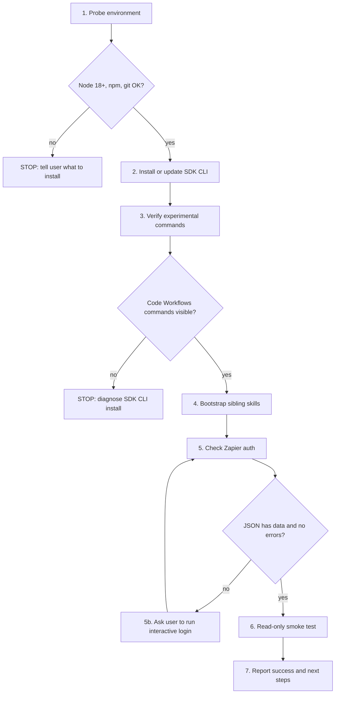

# Zapier Workflows Early Access Install

Imperative recipe. Each step gates the next. Do not skip a step that failed.

This is the public-first EA path. It uses the Zapier SDK CLI and does not install the legacy `@zapier/zapier-sdk-code-substrate` package.

## Flow



## What This Installs

- `@zapier/zapier-sdk-cli@latest` — public npm package that provides `zapier-sdk`, `zapier-sdk-cli`, and `zapier-sdk-experimental`. Installed globally.
- Four companion skills installed through the `skills` CLI: `workflows/build`, `workflows/list`, `workflows/history`, and `workflows/modify`.

What this does not install:

- `@zapier/zapier-sdk-code-substrate` — old private CLI path. Do not install it for EA.
- `@zapier/zapier-durable` globally. The build skill installs or pins it inside workflow projects when needed.

## Step 1: Probe Environment

Run each check. If any fails, stop and tell the user how to fix it.

```bash
node --version
npm --version
git --version
```

Expected output:

```bash
v18.0.0   # or higher
10.x.x    # npm version; any current version is fine
git version 2.x.x
```

Requirements:

| Tool | Minimum version | Install if missing |
|---|---|---|
| Node | 18 | `brew install node` or use nvm |
| npm | any current version | bundled with Node |
| git | any | usually preinstalled on macOS; otherwise `brew install git` |

If Node or npm is missing, explain that Node includes npm and the user needs a normal Node install before continuing. For macOS users, suggest either the Node LTS installer from `nodejs.org`, Homebrew (`brew install node`), or nvm if they already use it. Do not continue until `node --version` and `npm --version` work.

If git is missing, explain that git is needed only to download the companion skills from GitHub. For macOS users, suggest installing Apple Command Line Tools or Homebrew git. Do not continue until `git --version` works.

## Step 2: Install Or Update The Zapier SDK CLI

Check for an existing binary and the latest published CLI version:

```bash
which zapier-sdk
zapier-sdk --version
npm view @zapier/zapier-sdk-cli version
```

If `zapier-sdk` is missing, install the CLI globally:

```bash
npm install -g @zapier/zapier-sdk-cli@latest
```

If `zapier-sdk` already exists, do not assume it is usable yet. Continue to Step 3 and verify the Code Workflows commands. If Step 3 fails because Code Workflows commands are missing, update the CLI with `npm install -g @zapier/zapier-sdk-cli@latest`, then retry Step 3 once.

Verify the binary is on PATH:

```bash
which zapier-sdk
zapier-sdk --version
```

If global npm installs fail because of permissions, tell the user to fix their Node/npm setup before retrying. Prefer a user-owned Node install through nvm or Homebrew over `sudo npm install -g`.

## Step 3: Verify Code Workflows Experimental Commands

```bash
zapier-sdk --experimental --help
```

Expected output includes the Code Workflows command group, including commands such as:

```text
create-workflow
list-workflows
run-durable
publish-workflow-version
list-workflow-runs
```

The equivalent binary may also work:

```bash
zapier-sdk-experimental --help
```

If neither form exposes Code Workflows commands, stop and diagnose the SDK CLI install. Do not fall back to `@zapier/zapier-sdk-code-substrate`.

If `zapier-sdk` exists but the Code Workflows command group is missing, the user likely has an older SDK CLI. Run:

```bash
npm install -g @zapier/zapier-sdk-cli@latest
zapier-sdk --experimental --help
```

Proceed only after the Code Workflows command group is visible.

## Step 4: Bootstrap The Workflows Companion Skills

Install the companion skills into the current workspace. This does not require Zapier authentication, so do it before the login gate.

Use the public `skills.sh` install path. The `npx` command runs the `skills` CLI; the skill content comes from the public `zapier/agent-skills` GitHub repo after that repo is published.

```bash
npx skills add zapier/agent-skills --skill zapier-workflows-build --yes
npx skills add zapier/agent-skills --skill zapier-workflows-list --yes
npx skills add zapier/agent-skills --skill zapier-workflows-history --yes
npx skills add zapier/agent-skills --skill zapier-workflows-modify --yes
```

Verify:

```bash
npx skills list --json
```

Expected output should include the installed workflows companion skills: `zapier-workflows-build`, `zapier-workflows-list`, `zapier-workflows-history`, and `zapier-workflows-modify`.

If any companion skill is missing, rerun the specific `npx skills add ...` command and diagnose before proceeding.

Updates later use the standard `skills` CLI update path:

```bash
npx skills update --project
```

## Step 5: Authenticate To Zapier

Check auth state first:

```bash
zapier-sdk get-profile --json
```

Treat auth as successful only if the JSON has a non-null `data` object with an email and the `errors` array is empty. Do not rely on exit code alone; some SDK CLI auth failures return exit code 0 with errors in the JSON body.

Expected successful output includes the user's email:

```json
{
  "data": {
    "email": "user@example.com"
  },
  "errors": []
}
```

If `data` is null, `errors` is non-empty, or the error message says authentication is required, stop and ask the user to run the interactive login command in a real terminal:

```bash
zapier-sdk login
```

This opens a browser. The CLI error text may suggest `npx zapier-sdk login`, but after the global install above the preferred command is `zapier-sdk login`. Do not run browser login inside a non-interactive shell or background process unless the user explicitly asks you to manage the interactive login. After the user finishes login, rerun `zapier-sdk get-profile --json` and inspect the JSON again.

For Zapier employees, the normal path is to log in with their Zapier work account. For external-user testing, use the account that has been allowlisted for Zapier Workflows EA.

Do not ask the user for a Zapier password, API key, npm token, or copied auth token. Authentication should happen through the browser-based `zapier-sdk login` flow unless the user explicitly says they are using client credentials for automation.

If the user wants non-interactive auth for automation, note that the CLI error message may mention `ZAPIER_CREDENTIALS` or client credential environment variables. For this EA install path, prefer browser login unless the user already has client credentials.

## Step 6: Smoke Test

Confirm the install path works end-to-end with a read-only Code Workflows call:

```bash
zapier-sdk --experimental list-workflows --json
```

Expected output is JSON containing workflow data or an empty list. This command should not create or modify cloud state.

Treat the smoke test as successful only if the JSON has workflow data or an empty workflow list and no errors. Do not rely on exit code alone; this command may return exit code 0 while the JSON body contains errors. If `data` is null, `errors` is non-empty, or the error message says authentication is required, return to Step 5. If it says the command is unknown, return to Step 3 and diagnose the CLI version.

## Step 7: Report Success

Tell the user:

- Zapier SDK CLI is installed and on PATH, confirmed via `which zapier-sdk`.
- Code Workflows experimental commands are available.
- The authenticated Zapier account email from `zapier-sdk get-profile --json`.
- Four companion workflow skills are installed: `workflows/build`, `workflows/list`, `workflows/history`, and `workflows/modify`.
- Read-only workflow listing succeeded.
- This confirms SDK CLI install, skill bootstrap, login, and read-only Code Workflows access. It does not yet prove that building, publishing, triggering, or running a full workflow works.

Next steps for the user:

- Configure app connections at https://zapier.com/app/assets/connections before attempting to build workflows.
- Reload the Cursor workspace or restart Cursor so the new skills are picked up. This is required before Cursor can reliably auto-discover the installed workflow skills.
- Ask Cursor to build a workflow, for example: "Build me a Zapier workflow that takes a manual input and sends a Slack message."

## Troubleshooting

| Symptom | Likely cause | Fix |
|---|---|---|
| `node --version` prints less than `v18` | Old Node | `brew upgrade node` or use nvm to install a current LTS |
| `npm install -g` fails with permissions errors | Global npm prefix is not user-writable | Use nvm or Homebrew Node; avoid `sudo npm install -g` unless the user explicitly accepts that system-level change |
| `zapier-sdk --experimental --help` lacks Code Workflows commands | Old CLI or wrong package installed | Install `@zapier/zapier-sdk-cli@latest`, then rerun `zapier-sdk --version` and the help command |
| `zapier-sdk get-profile` says not logged in | User has not authenticated the CLI | Run `zapier-sdk login` in an interactive terminal, then retry |
| `get-profile` succeeds but `list-workflows` returns an access or permission error | The Zapier account may not be allowlisted for Zapier Workflows EA | Tell the user the SDK install worked, but their Zapier account needs Zapier Workflows EA access before the smoke test can pass |
| `list-workflows` returns `None of the security schemes (userJwt) successfully authenticated this request` | Code Workflows rejected the authenticated account even though SDK profile auth worked | Treat this as a Zapier Workflows EA allowlist/backend access issue. Confirm the account email and SDK profile ID with `zapier-sdk get-profile --json`, then ask the Zapier Workflows team to verify the allowlist/backend setup for that account |
| `zapier-sdk login` does not open a browser | No default browser configured, or remote/SSH session | Try `zapier-sdk login --no-browser` if supported by the installed CLI, or run from a local terminal |
| `zapier-sdk login` hangs in a non-interactive shell | `login` is browser-interactive; cannot run unattended | Ask the user to run it manually in an actual terminal |
| `npx skills add zapier/agent-skills --skill zapier-workflows-...` fails | Public skill source is unavailable, the skill has not been published yet, or network access failed | Confirm the `zapier/agent-skills` public repo and workflow skill path are available, then rerun the specific install command |
| Skills do not auto-invoke after install | Cursor has not reloaded `.cursor/skills/` | Reload workspace or restart Cursor |
